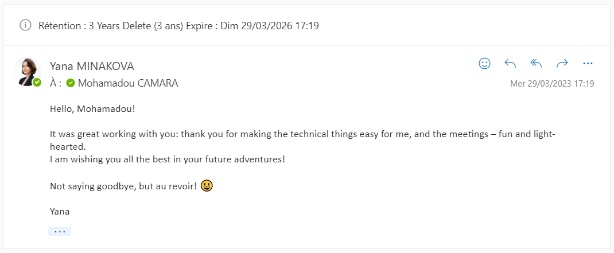
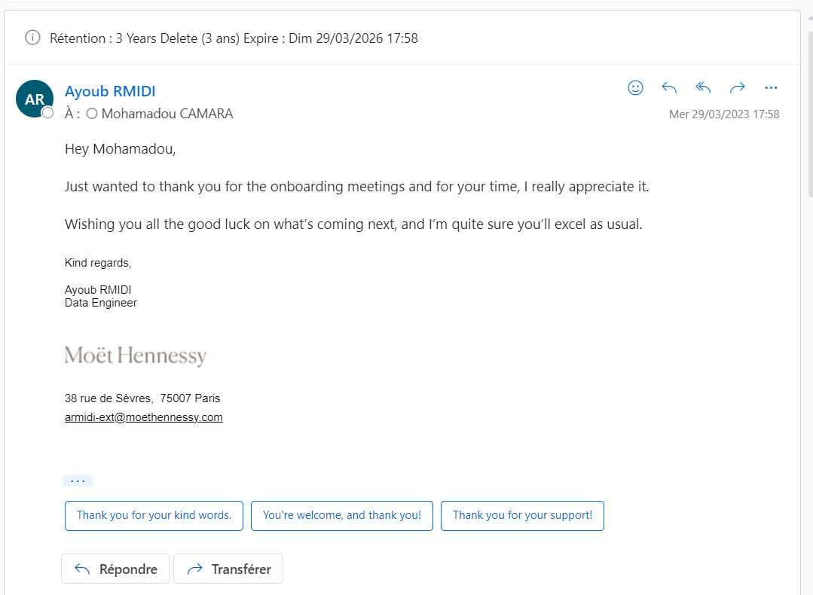

# Work Appreciation

This repository is a collection of feedback and kind words I've received from colleagues and clients during my professional journey. It serves as a testament to the positive impact I've made in my work environment.

## Feedback

### Vanessa

### Amira

### Yana

> It was great working with you: thank you for making the technical things easy for me, and the meetings—fun and light-hearted.
> I am wishing you all the best in your future adventures!
> Not saying goodbye, but au revoir! 😊

### Walid

> À la prochaine Mohamadou, c'était un plaisir de te rencontrer 😜
> Garde ta bonne humeur, j'aurais bien aimé bosser avec toi mais comme tu le dis si bien, je suis convaincu que nos chemins se croiseront de nouveau un jour.
> Bon vent 😜

### Victorien

> Merci pour tout Mohamadou ! Bonne continuation à toi !

### Ayoub

> Just wanted to thank you for the onboarding meetings and for your time, I really appreciate it.
> Wishing you all the good luck on what’s coming next, and I’m quite sure you’ll excel as usual.

## About Me

I am dedicated to making technical aspects easier for everyone and ensuring that our meetings are productive and enjoyable. I appreciate all the kind words and support from my colleagues.

Feel free to connect with me on [LinkedIn](https://www.linkedin.com/in/mohamadou-camara%E2%98%81%EF%B8%8F-000005a5/) or explore more of my work on [GitHub](https://github.com/camaramohamadou).
